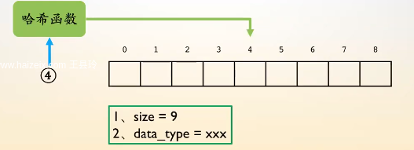
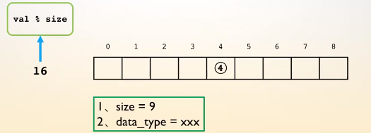
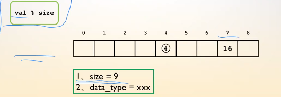
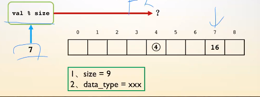
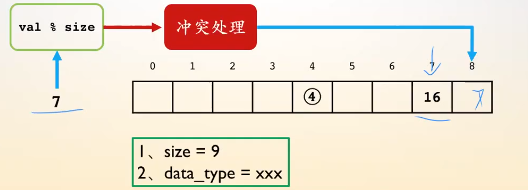

# 哈希表

哈希表是用来查找的一种数据结构

数组的作用是通过下标去索引里面存的值，时间复杂度为O(1)，我们借用数组的性质，将任意类型的值直接索引到相应的位置。

为了维护哈希表的性质，包含了两个结构操作：

## 1.哈希函数的方法：

哈希函数：将任意类型的元素映射成一个整形的值

哈希函数的操作原理，通过当前待插入元素值val % size，所得值为待插入元素映射出的下标值。

当下次映射出的位置里有值时，就会产生冲突。

那么我们就需要进行冲突处理：

## 2.处理冲突的方法：

1.开放定值法：

2.拉链法：

3.再哈希法：如果第一个哈希函数产生了冲突，那就去调用第二个哈希函数，看是否产生冲突。

4.建立公共溢出区：比如产生冲突时，映射出当前位置存在的值，那么我们就建立一片公共的区域去存储已经产生冲突的值。这片公共的位置就是溢出区。

常用的方法是第一个和第二个，拉链法是链表的意思。

